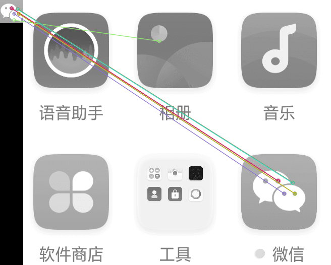

<h1 align="center">findit</h1>

    <em>Find target icon on your picture, and get its position.</em>

---

---

# 定位

findit 极大简化了图像识别的繁琐流程，强大而简洁的API让你只需要几行代码就可以在你的目标图片中找到模板图片的位置！

目前，[stagesep2](https://github.com/williamfzc/stagesep2) 与 [fitch](https://github.com/williamfzc/fitch) 均使用该工具作为图像处理引擎。

# 快速开始

 从我们的 [官方文档](https://williamfzc.github.io/findit/) 开始吧！

# LICENSE

[MIT](LICENSE)
