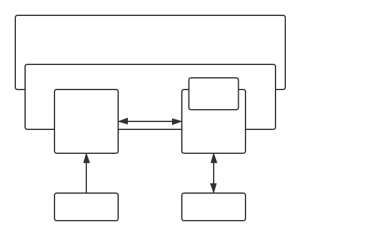

# Client/Server 模式

findit的最佳实践是配置在服务器上，以服务的形式满足不同的开发需要。这种架构主要为了解决两个问题：

- 图像识别效果更精确势必需要更高的算力。服务化之后，计算部分可以使用局域网内更高配置的机器来执行。
- 解决大量模板图片的规范化管理问题。



上图为一套完整的工作形态：

- [filebrowser](https://github.com/filebrowser/filebrowser)提供了极其方便的界面让用户能够直接用界面管理大量的模板图片，对他们分类及相应的规范化管理；
- findit-server 能够直接加载filebrowser的目录，并通过http协议与 findit-client 进行通信。你无须在客户机上管理模板图片。只要网络相通，你可以在任何地方使用findit服务；
- findit-client 是跨语言（甚至可以用shell）且跨平台的，只要具备http请求的能力！这意味着：
    - 能够在**不同机器、不同平台**上无痛接入findit的服务；
    - 本地**并不需要**安装相应的依赖；
    - 并不需要很高的性能，本地硬件需求低

## 服务端部署

服务端需求 python3.6+，**强烈推荐**用 docker 与 docker-compose 部署。

### 用 docker 部署

docker模式提供了一整套完整服务，非常适合部署在远程服务器。包括三个部分：

- 文件管理UI（端口29410）
- nginx文件服务器（端口29411）
- findit服务（端口29412）

你只需要执行下列命令就可以部署上述服务：

```bash
git clone https://github.com/williamfzc/findit.git
cd findit

# docker-compose.yml 可以根据实际需要修改
docker-compose up -d
```

简而言之，你可以在文件管理器上直接管理你的资源，并让它被findit使用。文件管理器来自 [filebrowser](https://github.com/filebrowser/filebrowser)。

### 用 命令行 部署

当然，如果你不想使用docker，你也可以直接用命令行启动 findit-server。

```bash
pip install findit
python -m findit.server --dir YOUR_PICTURE_DIR --port YOUR_PORT
```

- `YOUR_PICTURE_DIR` 换成你的图片库根目录
    - 如 `--dir ~/my_picture_dir`
    - 之后当 findit-server 需要图片时，会根据你传入的相对路径以这个目录为准开始查找
- `YOUR_PORT` 服务端口，默认9410

## 客户端

目前我们实现了python与java的client，可方便地嵌入现有框架，为框架带来图像识别能力。

- [Python2/3](https://github.com/williamfzc/findit-client)
- [Java](https://github.com/williamfzc/findit-java-client)
- ...

## 一个完整例子

以下例子以本地为例，远程部署同理。

例如你有两张图片，分别是微信图标：


与包含微信图标的手机截图：


我们希望找到微信图标在手机截图出现的位置。

1. 首先通过浏览器进入文件管理器 `127.0.0.1:29410`，账号密码`admin`。

2. 创建一个文件夹 `desktop`，上传微信图标 `wechat_logo.png`。


3. 服务端配置就完成了！可以在 `127.0.0.1:29411` 上看到你的图片。接下来你就可以直接在 client 中根据路径来使用。

4. 新建一个python脚本，用client进行操作：

```bash
from findit_client import FindItClient

# 初始化
cli = FindItClient(port=29412)
assert cli.heartbeat()

# 假设你的手机截图路径是 screen.png
# wechat_logo刚才被我们放在desktop目录下了，按照实际写就可以
result = cli.analyse_with_path('screen.png', 'desktop/wechat_logo.png')

print(result)
```

你可以获得跟本地一样的识别效果。

```text
{'data': {'temp_template': {'FeatureEngine': [524.6688232421875,
                                              364.54248046875],
                            'TemplateEngine': [505.5, 374.5]}},
 'target_name': 'temp_target',
 'target_path': '/tmp/tmprh4m59_x.png'}
```
